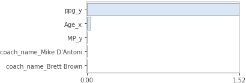
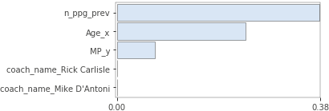

# Predicting NBA Player performance

    
 

In this project I want to predict player performance, as first step I will predict a players seasonal ppg (points per game)

Data Collection:
- player data collected from kaggle https://www.kaggle.com/drgilermo/nba-players-stats
- coach data was scraped from https://www.basketball-reference.com/coaches/
    - Scraped the data via BeautifulSoup
    - Scraping code is located in the Coach_Data.py

Data cleaning:
- merged the coach and the player datasets
- removed all data prior to 2005
- removed duplicates and NaN's
- code for data cleaning in Coach_Data.py, Season_Data.py, featurized_season_data.py

## Part1 - Data Exploration and initial modeling

    
 

Due to domain knowledge I chose a few features for the initial model, and I was particularly interested in assessing the coach feature effect
Chosen features:
 - Player Age
 - Player previous season ppg
 - Coach
 - previous season minutes played

 ### model1:
 - Created a random forest regressor model that takes in the features discussed above and predicts player ppg
 - I chose to use a limited amount of player features so it would be easier to identify if the coach effects the prediction
 - Created permutation feature importance to see which features are important
 - Tested the feature importance, see figure:

    
 

    
 

- This result shows that we get a good prediction only using previous season ppg, age and previous minutes played, whereas
    coach affect isn't showing.

### Is there a coach effect?

    
 

In order to understand this result I tried running the model again after normalizing the data based on player -->
normalized_ppg = player_ppg/max_player_ppg
I did this so players that have a high ppg average don't "hide" the coach effect.

model2:
- created a random forest model with normalized values
- Used the same features I used in model 1
- for this model the MSE is 0.044 whereas the benchmark is 0.081
- feature importance is still showing the coach has very limited effect

    
 

 

     
  

 Based on this result I decided to further investigate the coach effect:

 model3:
 In this model I tried to measure coach effect but on a team level and not a player level:
 - Tried to predict a team W/L % ratio based on previous season W/L% and coach.
 - Created a random forest model which got a MSE 0.0165 whereas the benchmark got 0.0168

 

     
 

 

      
 

 

       
 

 - again the result show that the significance of the coach is low

 Based on these results I decided to set up an hypothesis test that will determine the significance level of the coach.

## part2
Hypothesis testing:
- Null Hypothesis --> H0 - coach has no effect --> W/L% stays the same after team changes a coach
- Alternative Hypothesis --> Ha - team W/L% changes when a new coach comes
- Significance level &#x3B1; = 5%
- Ran the test comparing between W/L ratio between a season after a coach change and before

Assumptions:
- One game is a Bernoulli trial --> G ~ Bernoulli(P), E[G]=P
- One season of N games is a Binomial distribution --> S ~ Bin(N,P), E[S]=N*P
- S&#772; = S/N , E[S&#772;] = P
- D = S&#772;after - S&#772;before --> CLT --> D ~ (0,&#x3C3;)

Result of a 2 sided t-test:
- p-value = 0.00051 --> reject the null hypothesis --> cant rule out the effect of the coach --> needs further investigation
- According to this result I decided to continue optimizing the model without using the coach a feature

## part3 - Model optimization:
step 1 - feature engineering
- Tested different features to include in the model, most of the features didn't contribute
    - Benchmark MSE = 9.82
    - Model MSE = 9.328
- Ran a grid search on my random forest for hyper parameter optimization
    - max depth 3 --> 5
    - n_estimators 100 -->200
    - model MSE = 8.896
- Added two features rolling mean ppg and rolling variance ppg that include previous seasons
    - Model MSE = 8.77
- Added KMeans clustering to differentiate between players with high mean / low mean / high variance / low variance
    - cluster figure:
    

        
     

    - Model MSE = 8.744
- Tried using a GradientBoost model and a AdaBoost model --> bigger error
- Removed features with low permutation importance:
    - Model MSE = 8.676 --> final model
    - Key features:
        - Previous year ppg
        - Cluster (8 clusters, label0 - label6)
        - Age
        - log mean ppg
        - var ppg

## Part 4 - Results
- The final model MSE error is 8.676 and is based in a cross validation preformed with this function cross_val.py
- Class residuals figure example for year 2017:

    
 

